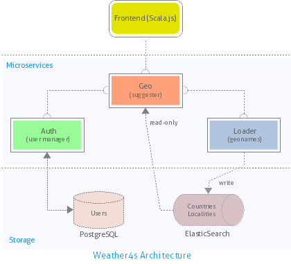

Weather4S
=========

[](https://gitter.im/sherpair/weather4s?utm_source=badge&utm_medium=badge&utm_campaign=pr-badge&utm_content=badge)



---

### Requirements

- JDK 8+
- scala 2.13+
- sbt 1.3+ 
- docker 19+
 
### Build

```shell
$ sbt ";compile; docker:publishLocal" && docker system prune -f
```

### Tests

```shell
$ sbt ";test; it:test"
```
Every microservice can still be independently tested:
```shell
$ sbt "project auth" ";test; it:test"
$ sbt "project geo" ";test; it:test"
$ sbt "project loader" ";test; it:test"
```

## Running Weather4s

```shell
$ ./bin/start-w4s-ssl.sh
```
and 
```shell
$ ./bin/stop-w4s-ssl.sh
```
to stop the application.

The Geo service can also just use http (at port 8082), instead of https, by starting Weather4s with: 
```shell
$ ./bin/start-w4s.sh
```
In that case, it can be stopped running:
```shell
$ ./bin/stop-w4s.sh
```

#### Health checks (e.g. with HTTPie)
```shell
$ http :8081/auth/health
$ http --verify no https://0.0.0.0:8443/geo/health
$ http :8083/loader/health
```

#### Configuration

All Weather4s' configuration properties can be found in one file, **bin/env-w4s**.

#### Running a single microservice

```shell
$ ./bin/run-postgres.sh; sbt "project auth" run     # Auth requires Postgres
$ ./bin/run-elastic.sh;  sbt "project geo" run      # Geo requires ElasticSearch
$ ./bin/run-elastic.sh;  sbt "project loader" run   # Loader requires ElasticSearch
```
Every running microservice can then be stopped with Ctrl-C while the Postgres and the ElasticSearch
containers respectively with `docker stop w4sPostgres` and `docker stop w4sElastic`.

## REST Endpoints

**TBD**
